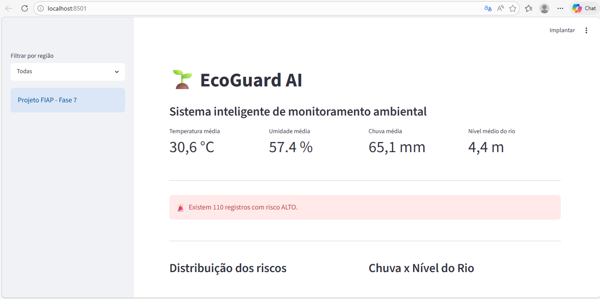
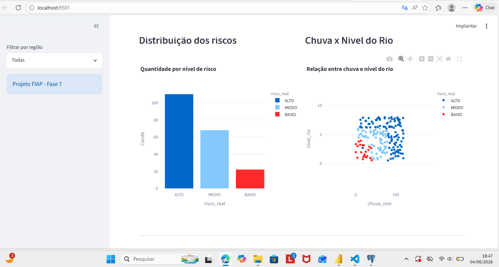
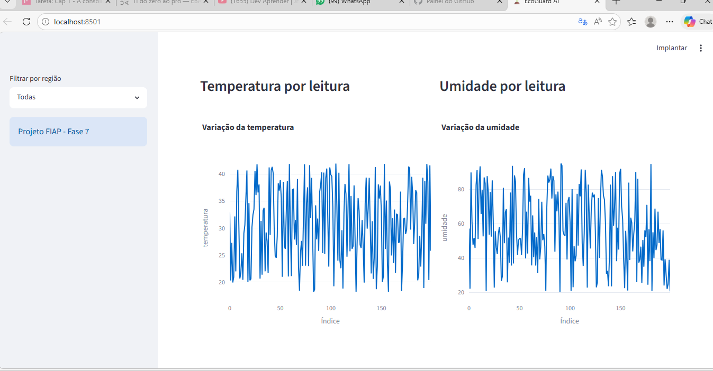
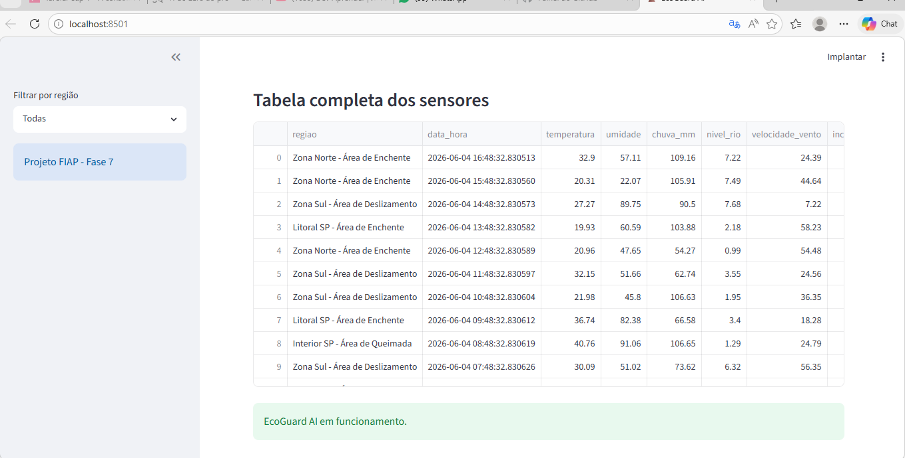
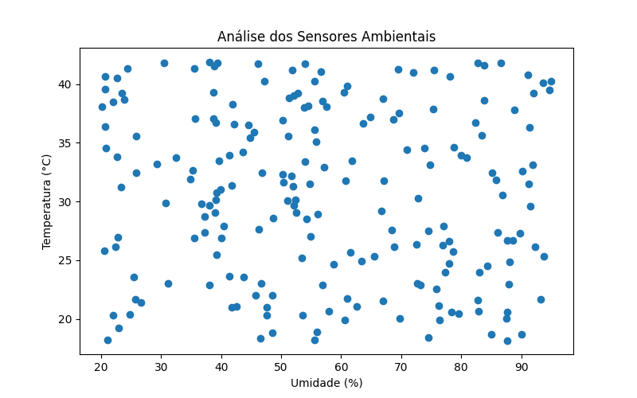
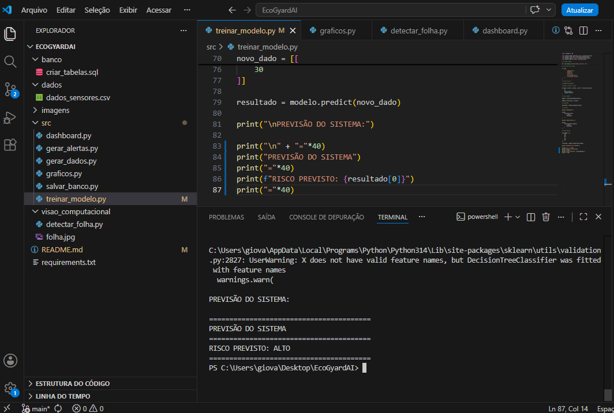
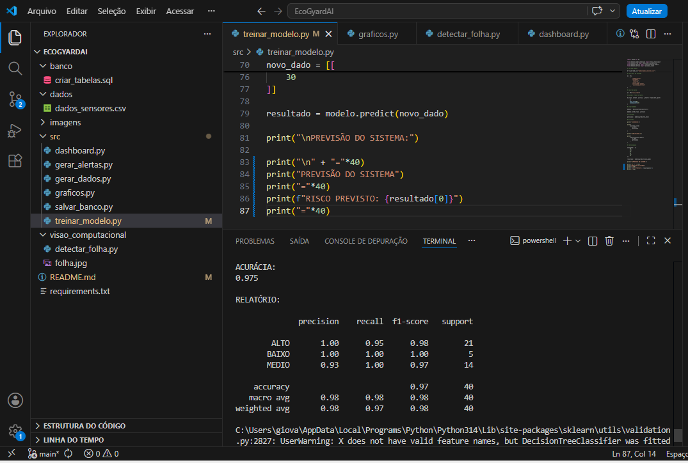
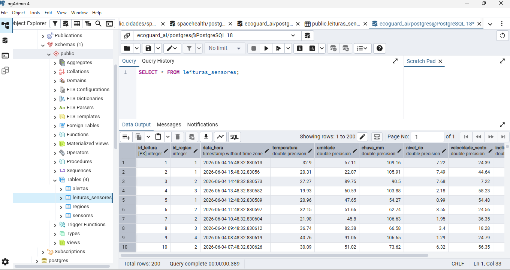
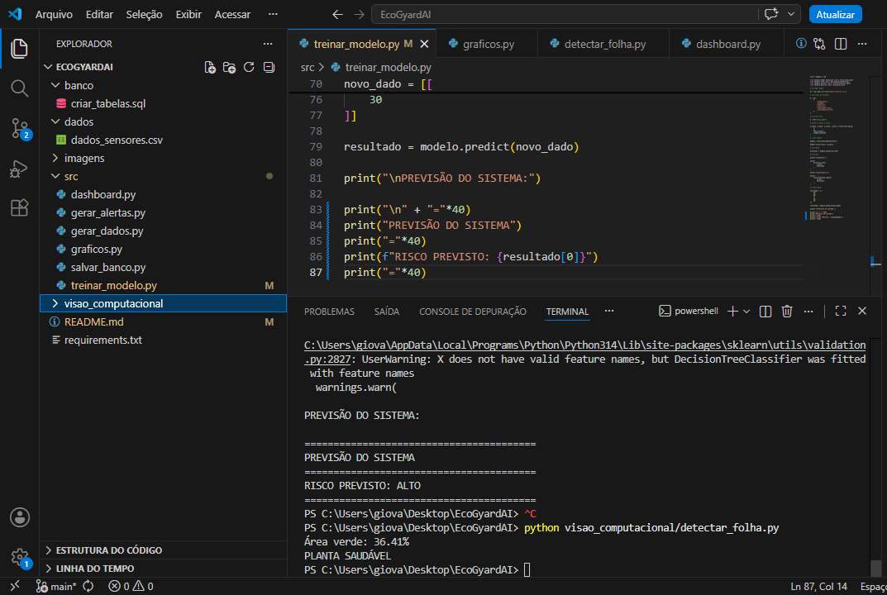
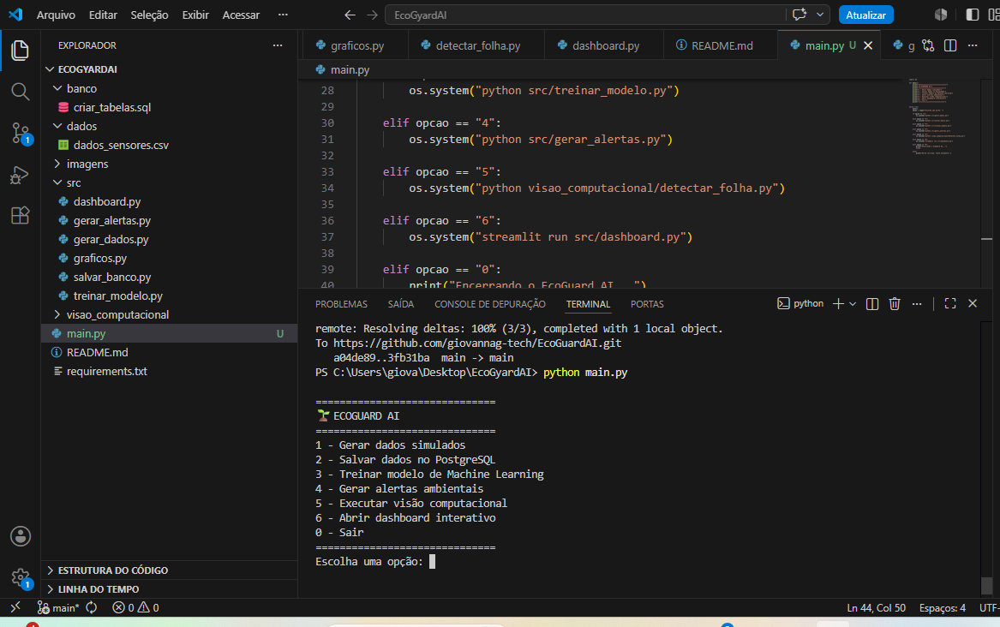

# 🌱 EcoGuard AI

Sistema inteligente de monitoramento ambiental para agricultura, utilizando Inteligência Artificial, Machine Learning, PostgreSQL, Visão Computacional e Dashboard Interativo.

O projeto tem como objetivo auxiliar na identificação de riscos ambientais, como enchentes, deslizamentos e queimadas, por meio da análise de dados simulados de sensores.

---

## 🎯 Objetivo

Desenvolver uma solução inteligente capaz de monitorar condições ambientais, classificar situações de risco e apoiar a tomada de decisão preventiva.

---

## 🚀 Tecnologias Utilizadas

- Python
- PostgreSQL
- Pandas
- Scikit-Learn
- Streamlit
- Plotly
- OpenCV
- Git e GitHub

---

## 🧠 Funcionalidades

- Geração de dados ambientais simulados
- Armazenamento das leituras em banco PostgreSQL
- Classificação automática de riscos com Machine Learning
- Dashboard interativo com filtros e gráficos
- Visão computacional para análise de folhas
- Sistema de alertas ambientais

---

## 🏗️ Arquitetura do Projeto

1. Geração de dados ambientais simulados.
2. Armazenamento das leituras no PostgreSQL.
3. Processamento dos dados com Python.
4. Treinamento do modelo de Machine Learning.
5. Geração de alertas ambientais.
6. Visualização dos resultados no Dashboard.
7. Análise complementar com Visão Computacional.

---

## 📂 Estrutura do Projeto

```text
EcoGuardAI/
├── banco/
│   └── criar_tabelas.sql
├── dados/
│   └── dados_sensores.csv
├── imagens/
│   ├── dashboard1.png
│   ├── dashboard2.png
│   ├── dashboard3.png
│   ├── dashboard4.png
│   ├── grafico_sensores.png
│   ├── machine_learning1.png
│   ├── machine_learning2.png
│   ├── postgresql.png
│   └── visao_computacional.png
├── src/
│   ├── dashboard.py
│   ├── gerar_alertas.py
│   ├── gerar_dados.py
│   ├── graficos.py
│   ├── salvar_banco.py
│   └── treinar_modelo.py
├── visao_computacional/
│   ├── detectar_folha.py
│   └── folha.jpg
├── requirements.txt
└── README.md
```

---

## 📊 Dashboard Interativo

### Visão Geral do Sistema



**Função:** Tela principal do EcoGuard AI.

**O que mostra:** indicadores ambientais, temperatura, umidade, chuva, nível do rio e alertas automáticos de risco.

---

### Distribuição dos Riscos



**Função:** Exibir a classificação dos riscos ambientais.

**O que mostra:** quantidade de registros classificados como baixo, médio e alto risco pelo modelo de Machine Learning.

---

### Análise Climática



**Função:** Monitoramento das condições ambientais.

**O que mostra:** gráficos de temperatura, umidade, chuva e comportamento dos sensores.

---

### Monitoramento Ambiental



**Função:** Apoiar a tomada de decisão.

**O que mostra:** evolução dos dados ambientais utilizados pelo sistema.

---

## 📈 Análise dos Sensores



**Função:** Visualizar tendências ambientais.

**O que mostra:** comportamento dos sensores ao longo do tempo para identificar situações críticas.

---

## 🤖 Machine Learning



**Função:** Treinamento do modelo preditivo.

**O que mostra:** algoritmo de Machine Learning responsável pela classificação automática dos riscos ambientais.

---



**Função:** Teste do modelo treinado.

**O que mostra:** previsão automática de risco alto, médio ou baixo baseada nos dados recebidos.

---

## 🗄️ Banco de Dados PostgreSQL



**Função:** Armazenamento dos dados ambientais.

**O que mostra:** tabela contendo as leituras dos sensores utilizadas pelo sistema.

---

## 👁️ Visão Computacional



**Função:** Análise visual de folhas.

**O que mostra:** utilização do OpenCV para processamento de imagens agrícolas.

---

## ⚠️ Sistema de Alertas

O sistema gera alertas automáticos para:

- Enchentes
- Deslizamentos
- Queimadas

Os alertas são exibidos diretamente no Dashboard para auxiliar a tomada de decisão preventiva.

---

## 🎛️ Consolidação do Sistema (Fase 7)

A Fase 7 teve como objetivo integrar todos os módulos desenvolvidos anteriormente em um único sistema executável.

Foi criado um menu principal em Python responsável por centralizar os serviços de:

- Geração de dados simulados
- Armazenamento no PostgreSQL
- Machine Learning
- Sistema de alertas
- Visão computacional
- Dashboard interativo

Dessa forma, o usuário consegue acessar todas as funcionalidades do EcoGuard AI através de uma única interface.

### Menu Principal



**Função:** Centralizar todos os módulos do projeto.

**O que mostra:** Interface de navegação desenvolvida em Python permitindo executar cada etapa do sistema de forma integrada.

### Serviços Integrados

| Opção | Serviço |
|---------|---------|
| 1 | Gerar dados simulados |
| 2 | Salvar dados no PostgreSQL |
| 3 | Treinar modelo de Machine Learning |
| 4 | Gerar alertas ambientais |
| 5 | Executar visão computacional |
| 6 | Abrir dashboard interativo |
| 0 | Encerrar sistema |

### Benefícios da Consolidação

- Sistema centralizado em um único projeto.
- Melhor organização dos módulos.
- Facilidade de manutenção.
- Integração entre banco de dados, IA e visão computacional.
- Estrutura compatível com a proposta da Fase 7 da FIAP.

---

## 🎥 Vídeo Demonstrativo

Link do vídeo de apresentação:

**(https://youtu.be/brWi8_AmpV8)**

---

## 📌 Entrega Fase 7

Itens atendidos nesta entrega:

✅ Integração das fases em um único sistema

✅ Banco de dados PostgreSQL

✅ Machine Learning

✅ Dashboard interativo

✅ Visão computacional

✅ Sistema de alertas

✅ Documentação completa no GitHub

✅ Estrutura organizada em pastas

---

## 👩‍💻 Desenvolvido por

**RM- 567169 Giovanna Gomes Oliveira**
**RM- 568044 Gabriel Coppola**
**RM 567250 Cloves Silva Filho**

Projeto desenvolvido para aplicação dos conceitos estudados no curso de Inteligência Artificial da FIAP.